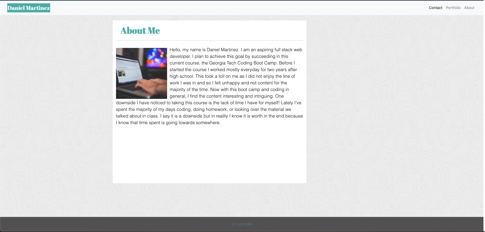

# Responsive-Portfolio

This web application was created to showcase the importance of responsive design. It ensures that elements will render well on a variety of devices and window or screen sizes. I was able to create this project with the help of an already existing design which needed to be cloned to near identical. Now because mobile web surfing is at an all time high I expect this won't be my first mobile responsive design. That being said, this is my *first* responsive design. 

## Installation of Repo

Follow these steps to view my project!
1. Open link in github. - https://github.com/xdanielmtz/responsive-portfolio
2. Clone with SSH
3. Run "git clone" command in Terminal with the pasted link
4. Run "code ." command to open in VS Code. 
5. Enjoy:)

## What will you find?

- An index.html (Main page)
- Contact.html (Contact page)
- Portfolio.html (My personal portfolio page) -- Empty of course as I have no prior projects.

## Upon closer inspection you will notice:

A fully functional deployed application

A consistent navbar throughout each page with working links to Home/About, Contact, and Portfolio pages.

Semantic elements. With this project I used semantic elements very sparingly I must say. My main focus throughout the project was to get my final product looking as close to the copy given to me. I did in the end use one or two semantic elements. 

Personalized information. Now on this requirement I was told from the beginning not to put personalized information by the instructor, not on this particular project. But on the readme I noticed it did say to specify my personal info. So with the little time I had after noticing this I did add some, particularly in the Home page.

Proper usage of Bootstrap components and grid system. You will see examples of this with the navbar. I of course added style to it later on. You will see the example of the grid system in play in the contact page, utilizing the container, row, and columns classes provided by bootstrap.

## Deployed Site Link: 
[Responsive Portolio] (https://xdanielmtz.github.io/responsive-portfolio/index.html)

## Sneak Peak:

